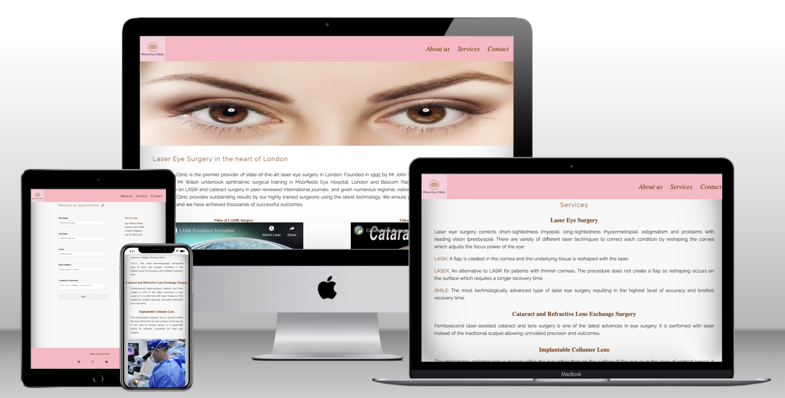
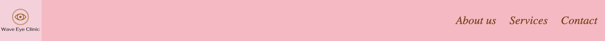
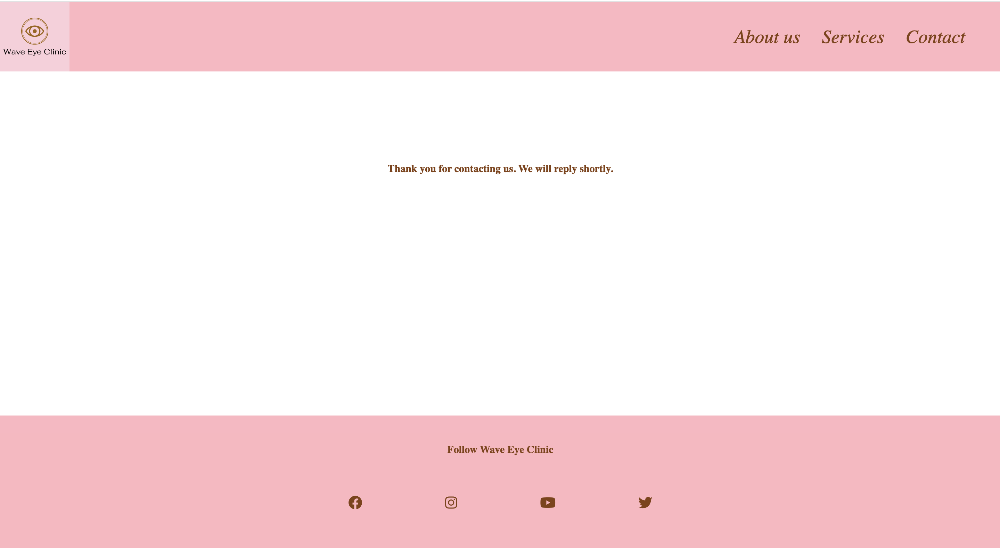
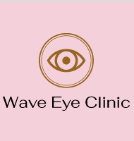
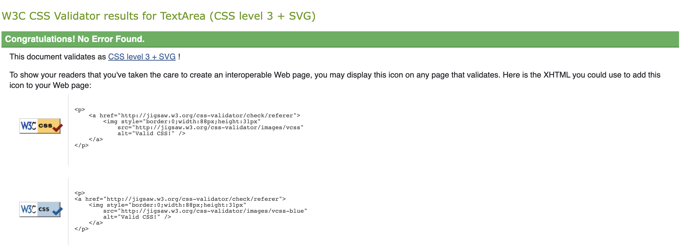
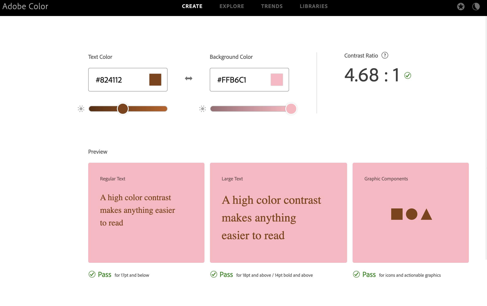
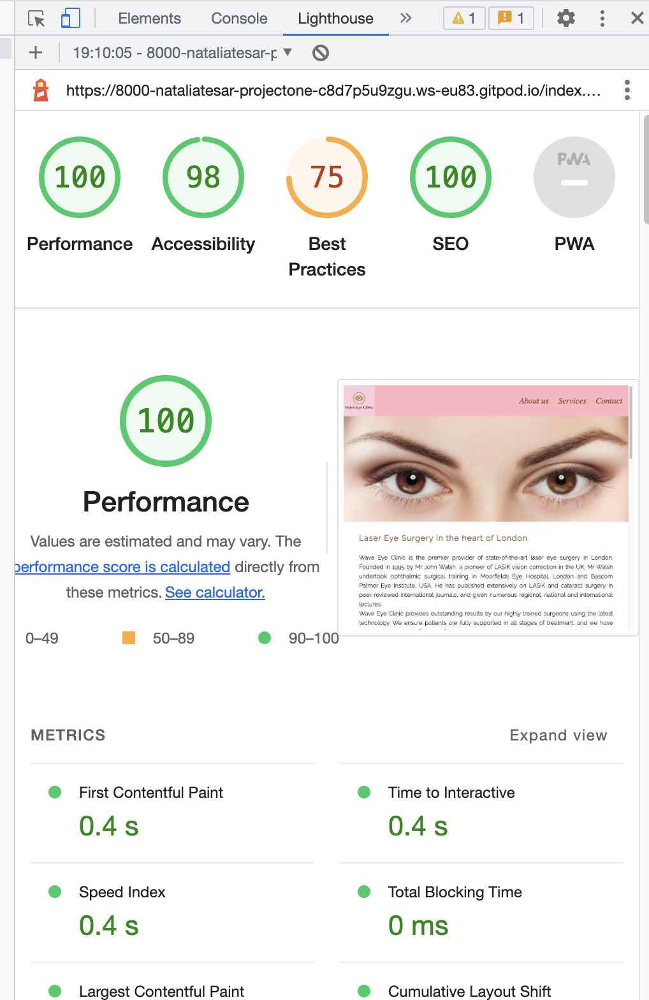
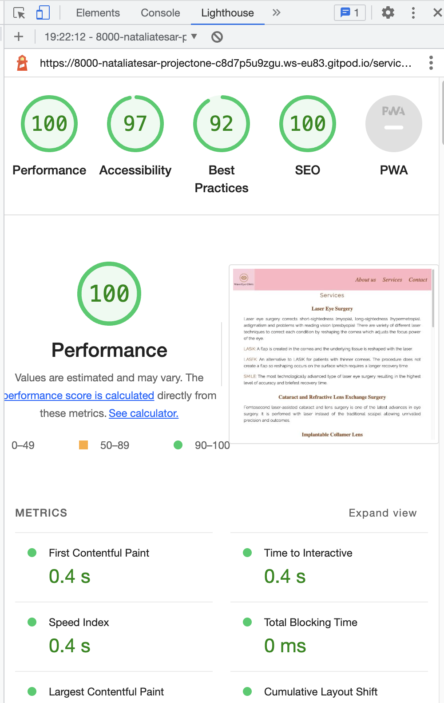
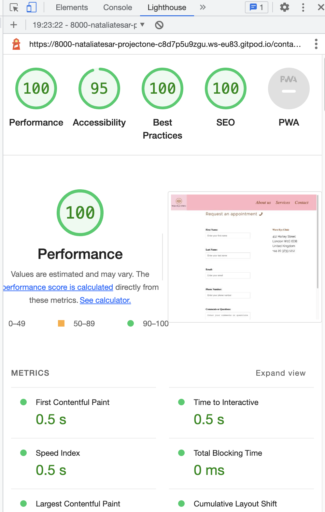

# Wave Eye Clinic
Wave Eye clinic is an ophthalmic surgery centre which offers laser refractive and lens surgery. The website aims to gives prospective patients the essential information about the practice and surgeons, surgical procedures and finance options. Patients are also able to submit contact details to arrange a consultation. View the live site [here](https://nataliatesarova.github.io/project-one/index.html).



## Features 
### Navigation bar

* Navigation Menu
    * Contains links to the About us, Services and Contact on all pages, with hover feature, and will be responsive on devices of differing size.
    * Opens in the same tab and allows users to easily navigate between the pages within the site.
 


### The landing page image
* The landing page has a pleasant image of a woman's eyes which immediately tells the viewer that they have arrived at an ophthalmology site. The eyes literally make direct eye contact with the user.

### Introduction to the clinic and main surgeon
* Information on the educational and training background of the principle surgeon and clinic owner, and the high level of care and treatment that patients can expect.


### Surgical videos
*  Embedded Youtube videos of LASIK and cataract surgery, which are the two main treatmens offered by the clinic. 


### Emphasis of clinic attributes
* The high quality of the surgeons and surgical equipment, and finance options are briefly summarised in three headed columns. 


### Footer
* The footer contains the icons and links to the clinic's social media sites on Facebook, Instagram, YouTube and Twitter that will open in new tabs. 
* This will alow the user to see the most up-to-date information, which may not yet be available on the clinic website.

  
### Services
* The services section gives the user information on the main surgical procedures offered by the clinic including laser eye surgery (LASIK, LASEK and SMILE), cataract surgery, refractive lens exchange and implantable collmaer lenses.

* Three images are included in a gallery at the bottom of the page showing an operating eye surgeon, doctor checking the eye with a torch, and doctor examining a patient at the slit-lamp microscope.


### Contact
* The contact page allows users to request an appointment for a consultation at the clinic. The user is presented with 5 fields to input first name, last name, email address, telephone number and comments/questions. 
* The clinic address and telephone number are also presented on the contact page allowing another mode of contact.

* On pushing the send button a new page is opened stating 'Thank you for contacting us. We will reply shortly'.


### Features left to implement
* A possible future enhancement would be to add javascript to send an email directly to the Wave Eye Clinic.

### Accesibility
* Use of semantic HTML.
* Use of ARIA labels allowing ientification by screen readers.
* Use of alt attributes to provide alternative information for users.
* Use of Adobe Color to check colour contrast.
* Color contrasts meet the standards specified in [WCAG 2.1 contrast guidelines](https://www.w3.org/WAI/WCAG21/Understanding/contrast-minimum.html).

##  Design
### Color scheme
The background color on the header and footer is pink RGB (255,182,193). The font color in the header, footer, and headings is brown RGB (130,65,18). The main text is black RGB (0,0,0) on white RGB (255,255,255) background. 

### Typography
* Raleway font from Google fonts.
* Times font.

### Logo
The logo was designed on [Free Logo Design](https://www.freelogodesign.org/) and incorporated into the header.



### Images
The source of all images are provided in the credit section.

### Balsamiq frameworks
Home page


Services page


Contact Page


Submission and thank you page


## Testing
### Responsiveness
* All pages were tested and found to be resposive using [TechSini Multi device Website Mockup Generator](https://techsini.com/multi-mockup/) and Google Chrome DevTools. The web site was tested on Google Chrome, Safari, Mozilla Firefox, Microsoft Edge and Opera browsers with iPhone SE, iPhone 14 Pro, iPhone 14 Pro Max, Samsung Galaxy S8+, Ipad Air devices. Pass.

### Validator
* HTML: Errors were not found when passing through the official W3C validator.


* CSS: No Errors were found when passing through the official Jigsaw validator at the final check.


### Accessibility
* Adobe Color was used to test contrast for accessibility. 

* Lighthouse in the Chrome Developer Tools was used to test website performance, accessibility, and adherance to best practices and search engine optimization (SEO) advice. 




The 75% best practices was due to the landing page image being adequate but not ideal ratio and resoloution. The image was retained since it was responsive across devices and was my preferred image for the website.

### Bugs
* An error was found with the footer since the h3 ("Follow Wave Eye Clinic") was placed in the ul. This was fixed by moving the h3 above the ul. 
* A parse error was observed with the CSS Jigsaw validator since a curly bracket was omitted. This error was rectified on addition of the bracket.

### Manual testing

Navigation bar
  - About us - When selected, the page is redirected to the home page, the text is underlined when hovered. Pass.
  - Services - When selected, the page is redirected to the Services page. The text is underlined when hovered. Pass.
  - Contact - When selected, the page is redirected to the request appointment page. The text is underlined when hovered. Pass.
  - Logo - appears on all pages and is responsive. Pass.

Text
  - Confirm that text fonts were loaded and were responsive to different screen sizes. Pass.

Images
  - Check all images were loaded correctly and were responsive to different screen sizes. Pass.

Footer
 - Facebook – When clicking the icon, the Facebook page opens in a new tab. Pass.
 - Instagram - When clicking the icon, the Instagram page opens in a new tab. Pass.
 - YouTube - When clicking the icon, the YouTube page opens in a new tab. Pass.
 - Twitter - When clicking the icon, the Twitter page opens in a new tab. Pass.

Contact Form
  - Check that the form size was responsive to different screens sizes. Pass.
  - Check data can be correctly entered into the form input fields. Pass. 
  - Check that pressing the submit button redirects to 'Thank you for contacting us. We will reply shortly' page. Pass.

## Technologies used
### Languages
* HyperText Markup language (HTML) - the standard markup language for documents designed to be displayed in a web browser.
* Cascading Style Sheets (CSS) - used to describe the presentation of the document written in HTML.

### Frameworks, Libraries and Programs
* [Balsamiq](https://balsamiq.com/wireframes/)- used to create the wireframes.
* [Github](https://github.com/) - cloud based hosting service to save and store the files for webite.
* Git - version control system.
* [Visual Studio Code](https://code.visualstudio.com/) - the website was created using Microsoft Visual Studio Code integrated development environment (IDE).
* [Font Awesome](https://fontawesome.com/) - font and icon toolkit.
* [Google Fonts](https://fonts.google.com/about) - used to importing the fonts on the website.
* [Google Chrome DevTools](https://developer.chrome.com/docs/devtools/) - used for troubleshooting and testing features, and to solve issues with responsiveness and styling.
* [Multi Device Website Mockup Generator](https://techsini.com/multi-mockup/) - used to show website on range of devices.

## Deployment
### Version control
The site was created using Visual Studio Code editor (Microsoft) and pushed to github to the remote repository ‘ADD NAME’.

The following git commands were used to push code to the remote repository:

```git add <file>``` - This command added the file(s) to the staging area before they are committed.

```git commit -m “commit message”``` - This command allowed the commit of changes to the local repository queue.

```git push``` - This command pushed all committed code to the remote repository on github.

### Deployment to Github Pages
* The site was deployed to GitHub pages. Deployment requires the following steps: 
  - In the GitHub repository, navigate to the Settings tab 
  - From the menu on left select 'Pages'
  - From the source section drop-down menu, select the Branch: main
  - Click 'Save'
  - A link will be displayed in a green banner when published successfully. The link is available [here](https://github.com/nataliatesarova/project-one)

### How to Clone 
* To clone a repository from GitHub to your local machine.
  - In the GitHub repository click the Code button above the repository files.
  - Copy the URL for the repository and choose either: HTTP, SSH or GitHub CLI.
  - Open your terminal and change the current working directory to the location where you would like the cloned directory.
  - Type ```git clone```, paste the URL copied earlier and press enter.

## Credits
I would like to thank my mentor Gareth McGirr especially for advice regarding flexbox and the readme template. Chris Quinn gave valuable information in the Code Institute teaching sessions and especially helped with advice on the action attribute in the form tag of my HTML. I am grateful for the ophthalmology information provided by Mr Nakul Mandal, Consultant Ophthalmic Surgeon, Galway Clinic.

### Content
Logo was designed on [Free Logo Design](https://www.freelogodesign.org/)

Instructions on how to use FlexBox to split text in three columns on the About us page was provided by [The Wheelchair Guy](https://www.youtube.com/watch?v=Q1d-1FzdXEE), and [Cem Eygi Media](https://www.youtube.com/watch?v=qXRYMdvq_Dc).

The website icons were provided by [Font Awesome](https://fontawesome.com/)

### Media
All images and youtube videos are used here for educational purposes and there were no known copyright issues.

The brown eyes image on the index page was provided by the educational website [All About Vision](https://www.allaboutvision.com/conditions/eye-color-brown.htm) 

The LASIK animation was provided by [Vold Vision](https://www.youtube.com/watch?v=j9SANdddTlo&t=1s)

The cataract surgery animation was provided by [Fauquier ENT](https://www.youtube.com/watch?v=gRj6J0AGpPs)

Image of surgeon operating was provided by [Wikimedia Commons](https://commons.wikimedia.org/wiki/File:U.S._Air_Force_Maj._Matthew_Caldwell,_foreground_right,_a_cornea_and_refractive_surgeon_with_the_59th_Medical_Wing,_performs_cataract_surgery_June_5,_2013,_during_New_Horizons_2013_at_the_Southern_Regional_130605-F-FO324-008.jpg_eye_surugery)

Young Caucasian girl getting an eye examination picture taken from [Rawpixel](https://www.rawpixel.com/image/259737/girl-getting-eye-exam)

The image of the patient at the slit-lamp microscope was taken from the website of [Ekol International Hospitals](https://www.ekolhospitals.com/assets/upload/930185_8950-8251.jpg)


