# Wave Eye Clinic
Wave Eye clinic is an ophthalmic surgery centre which offers laser refractive and lens surgery. The website aims to gives prospective patients the essential information about the practice and surgeons, surgical procedures and finance options. Patients are also able to submit contact details to arrange an consultation.

## Features 
### Navigation bar

* Navigation Menu
    * Contains links to the About us, Services and Contact on all 3 pages and will be responsive on devices of differing size.
    * Opens in the same tab and 
    allows users to easily navigate between the pages within the site. 

### The landing page image
* The landing page has a pleasant image of a woman's eyes which immediately tells the viewer that the site is ophthalmic. The image of eyes literally makes eye contact with the user.

### Introduction to the clinic and main surgeon
* Information on the educational and training background of the principle surgeon and clinic owner, and the high level of care and treatment that patients can expect.
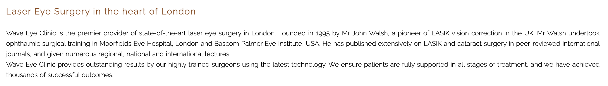

### Accesibility
* Use of semantic HTML
* Use of ARIA
* Use of alt attributes
* Use Adobe Color to check colour contrast
* Fixed header, providing visitors with easy access to other pages

### Surgical videos
*  Embedded Youtube videos of LASIK and cataract surgery, which are the two main treatmens offered by the clinic. 
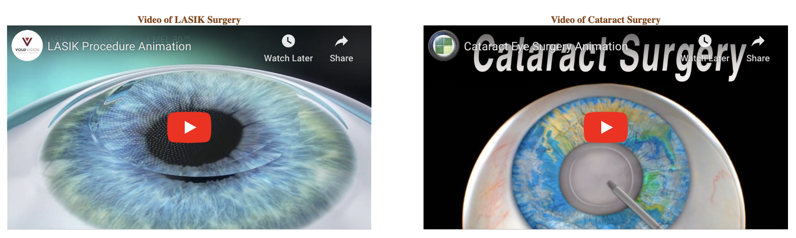

### Emphasis of clinic attributes
* The high quality of the surgeons and surgical equipment, and finance options are briefly summarised in three headed columns. 
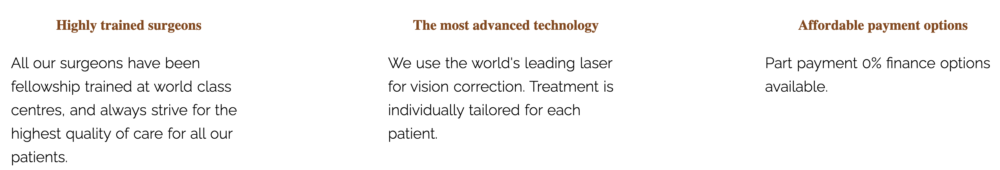

### Footer
* The footer contains the icons and links to the clinic's social media sites on Facebook, Instagram, YouTube and Twitter that will open in new tabs. 
* This will alow the user to see the most up-to-date information, which may not yet be available on the clinic website.
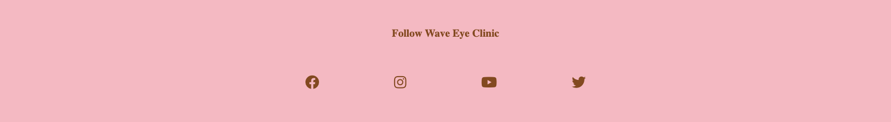
  
### Services
* The services section gives the user information on the main surgical procedures offered by the clinic including laser eye surgery (LASIK, LASEK and SMILE), cataract surgery, refractive lens exchange and implantable collmaer lenses.
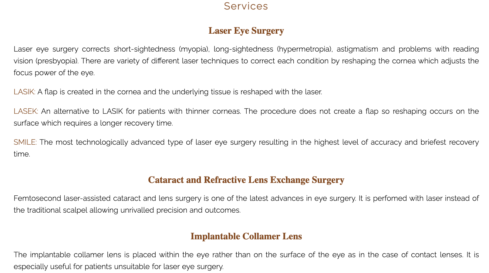
* Three images are included in a gallery at the bottom of the page showing an operating eye surgeon, doctor checking the eye with a torch and doctor examining a patient at the slit-lamp microscope.
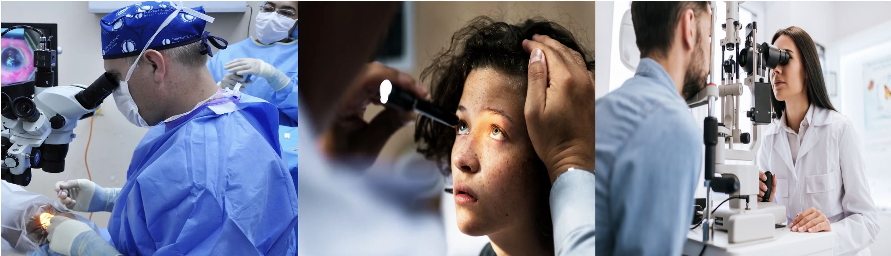

### Contact
* The contact page allows users to request an appointment for a consultation at the clinic. The user is presented with 5 boxes to input first name, last name, email address, telephone number and comments/questions. 
* On pushing the send button a new page is opened stating 'Thank you for contacting us. We will reply shortly'. (INSERT PIC OF THANK YOU PAGE)
* The clinic address and telephone number are also presented on the contact page allowing another mode of contact.
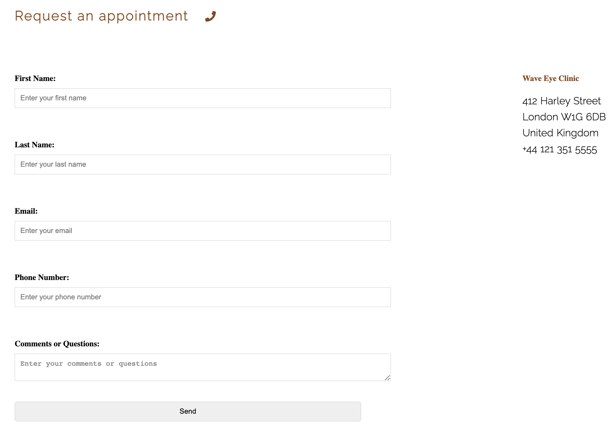

### Features left to implement
* A possible future enhancement would be to add javascript to send an email directly to the Wave Eye Clinic.

## Testing

### Responsiveness
* All pages were tested for resposiveness on 320px and up using the developer tools. The web site was tested on Google Chrome, Safari, Mozilla Firefox, Microsoft Edge and Opera browsers with iPhone SE, iPhone 14 Pro, iPhone 14 Pro Max, Samsung Galaxy S8+, Ipad Air devices.
* The web site opened as expected with no responsive issues in all cases apart from the navigation bar appearing too crowded on the smaller device screens. This issue was fixed by decreasing the navigation bar text font size.

### Validator
* HTML: Errors were not found when passing through the official W3C validator
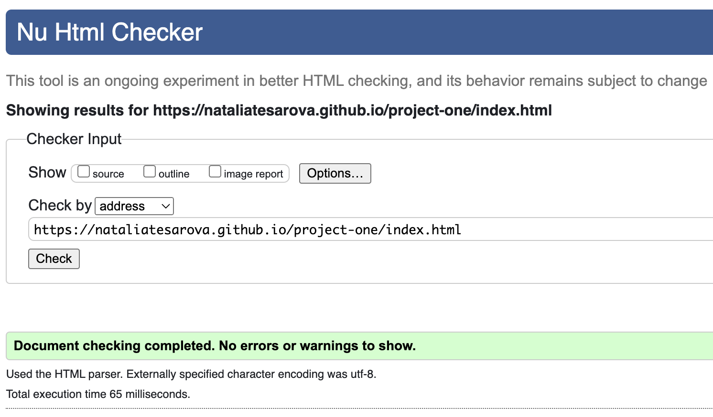
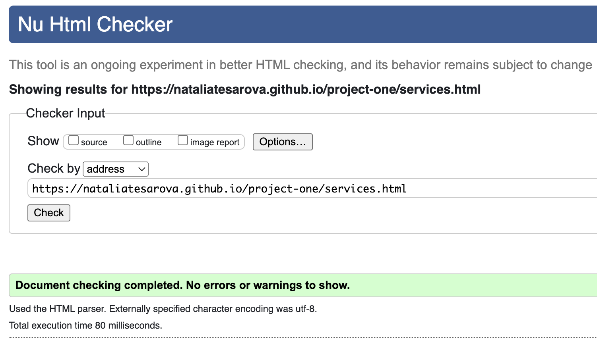
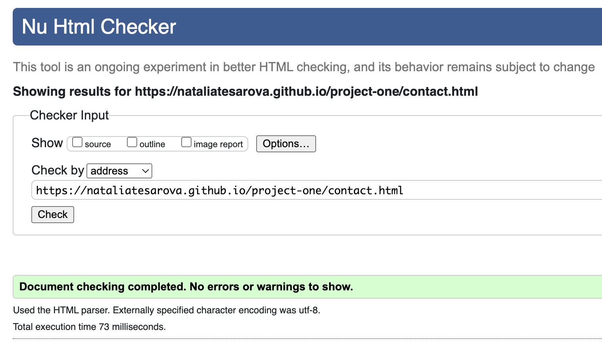
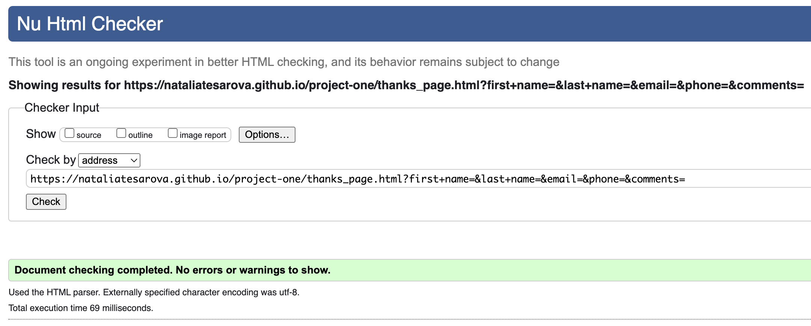
* CSS: Errors were not found when passing through the official Jigsaw validator (DO TEST AND INSERT PIC)

### Accessibility
* Adobe Color was used to test contrast for accessibility. (INSERT PIC OF ADOBE COLOR TEST)
* Wave accessibility (DO TEST CHANGE FONT COLOR AND INSERT PIC-LIGHTHOUSE ALSO TESTS ACCESSIBILITY)
* Lighthouse in the Chrome Developer Tools was used to test website performance, accessibility, best practices and SEO. (INSERT PIC)

### Bugs
An error was found with the footer since the h3 ("Follow Wave Eye Clinic") was placed in the ul. This was fixed by moving the h3 above the ul. Wave testing showed an empty link error with regard to the clinic logo. This did not appear to have any bearing on the website function and will be addressed in a future release.

##  Design
* Balsamiq frameworks

Home page
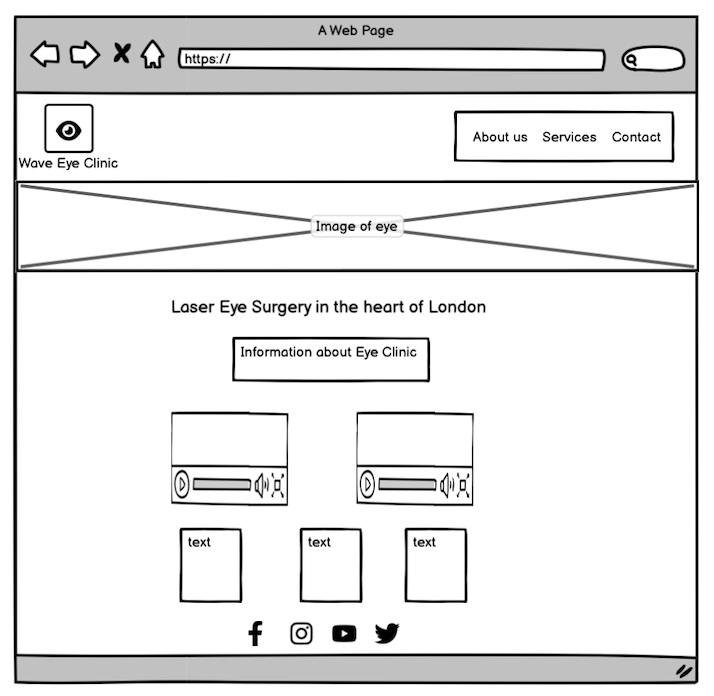
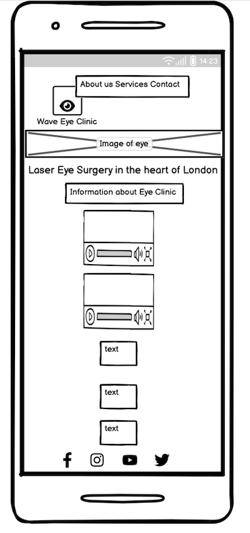

Services page
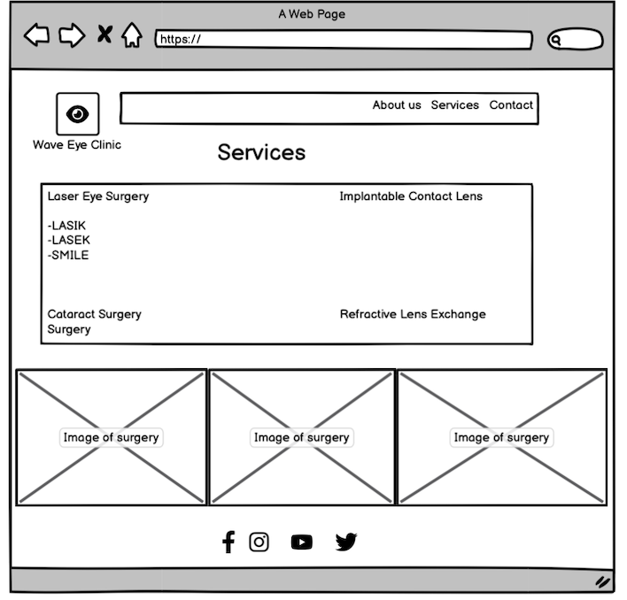
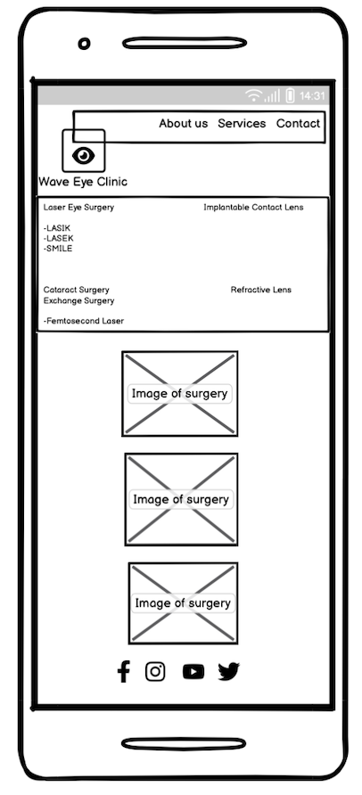

Contact Page

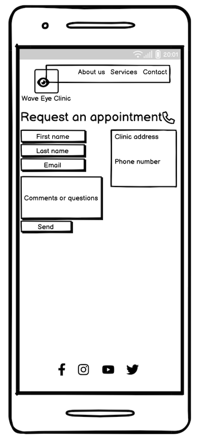

Submission and thank you page
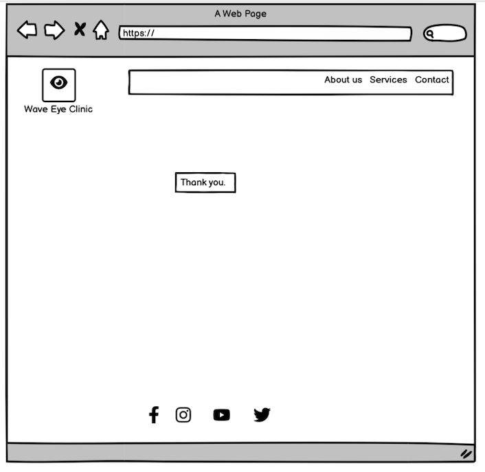
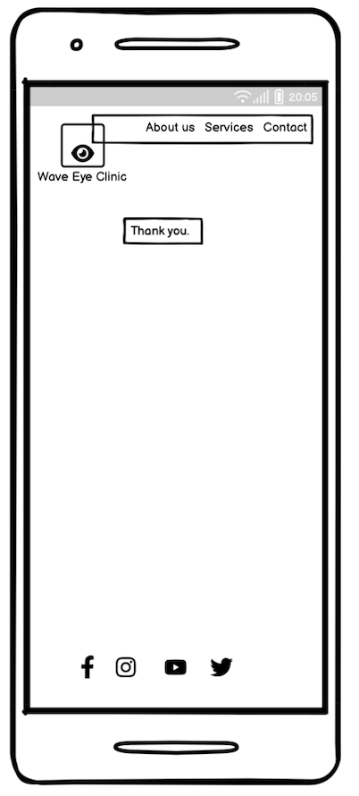

## Technologies used
### Languages
* HyperText Markup language (HTML) - the standard markup language for documents designed to be displayed in a web browser
* Cascading Style Sheets (CSS) - used to describe the presentation of the document written in HTML

### Frameworks, Libraries and Programs
* Balsamiq- used to create the wireframes
* Github - cloud based hosting service to save and store the files for webite 
* Git - version control system
* Font Awesome - font and icon toolkit
* Google Fonts - used to importing the fonts on the website
* Google Chrome DevTools - used for troubleshooting and testing features, and to solve issues with responsiveness and styling

