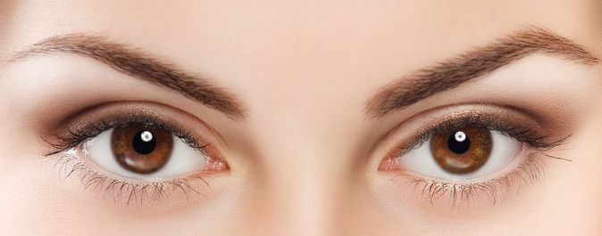

# Wave Eye Clinic
Wave Eye clinic is an ophthalmic surgery centre which offers laser refractive and lens surgery. The website aims to gives prospective patients the essential information about the practice and surgeons, surgical procedures and finance options. Patients are also able to submit contact details to arrange an consultation.
## Features 
### Navigation bar

* Navigation Menu
    * Contains links to the About us, Services and Contact on all 3 pages and will be responsive on devices of differing size.
    * Opens in the same tab and A
    allows users to easily navigate between the pages within the site. 

### The landing page image
* The landing page has a pleasant image of a woman's eyes which immediately tells the viewer that the site is ophthalmic. The image of eyes literally makes eye contact with the user.

### Surgical videos
*  Embedded Youtube videos of LASIK and cataract surgery, which are the two main treatmens offered by the clinic. (ADD SCREENSHOTS OF VIDEOS)

### Emphasis of clinic attributes
* The high quality of the surgeons and surgical equipment, and finance options are briefly summarised in three headed columns. (ADD SCREENSHOTS OF THE THREE TEXT COLUMNS)

### Footer
* The footer contains the icons and links to the clinic's social media sites on Facebook, Instagram, YouTube and Twitter that will open in new tabs. 
* This will alow the user to see the most up-to-date information, which may not yet be available on the clinic website.
  
### Services
* The services section gives the user information on the main surgical procedures offered by the clinic including laser eye surgery (LASIK, LASEK and SMILE), cataract surgery, refractive lens exchange and implantable collmaer lenses. 
* Three images are included in a gallery at the bottom of the page showing an operating eye surgeon, doctor checking the eye with a torch and doctor examining a patient at the slit-lamp microscope.

### Contact
* The contact page allows users to request an appointment for a consultation at the clinic. The user is presented with 5 boxes to input first name, last name, email,address, telephone number and comments/questions. 
* On pushing the send button a new page is opened stating 'Thank you for contacting us. We will reply shortly'.
* The clinic address and telephone number are also presented on the contact page allowing another mode of contact.

### Features left to implement
* A possible future enhancement would be to add javascript to send an email directly to the Wave Eye Clinic.

### Testing
* All pages were tested for resposiveness on 320 px and up using the developer tools. The web site was tested on Google Chrome, Safari, Mozilla Firefox, Microsoft Edge and Opera browsers with iPhone SE, iPhone 14 Pro, iPhone 14 Pro Max, Samsung Galaxy S8+, Ipad Air devices.

